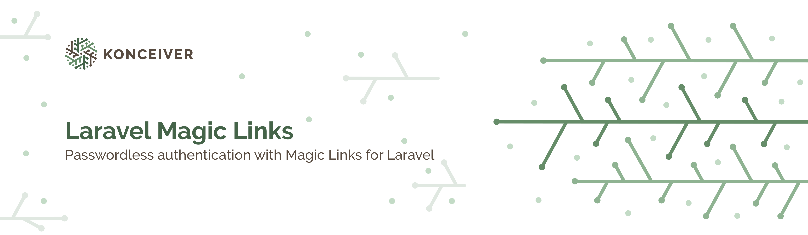

# Laravel Magic Links

<p align="center"></p>

[](https://packagist.org/packages/konceiver/laravel-magic-links)
[](https://packagist.org/packages/konceiver/laravel-magic-links)
[](https://img.shields.io/github/workflow/status/konceiver/laravel-magic-links/CI?label=CI)
[](https://packagist.org/packages/konceiver/laravel-magic-links)

This package was created by, and is maintained by [Brian Faust](https://github.com/faustbrian), and provides an easy way of using passwordless logins like [Slack](https://slack.com).

## Installation

```bash
composer require konceiver/laravel-magic-links
```

## Usage

See our [extensive test suite](./tests/Unit) for usage example.

## Testing

``` bash
composer test
```

## Changelog

Please see [CHANGELOG](CHANGELOG.md) for more information on what has changed recently.

## Contributing

Please see [CONTRIBUTING](CONTRIBUTING.md) for details.

## Security

If you discover a security vulnerability within this package, please send an e-mail to security@konceiver.dev. All security vulnerabilities will be promptly addressed.

## Credits

This project exists thanks to all the people who [contribute](../../contributors).

## Support Us

We invest a lot of resources into creating and maintaining our packages. You can support us and the development through [GitHub Sponsors](https://github.com/sponsors/faustbrian).

## License

Laravel Magic Links is an open-sourced software licensed under the [MIT](LICENSE.md).
